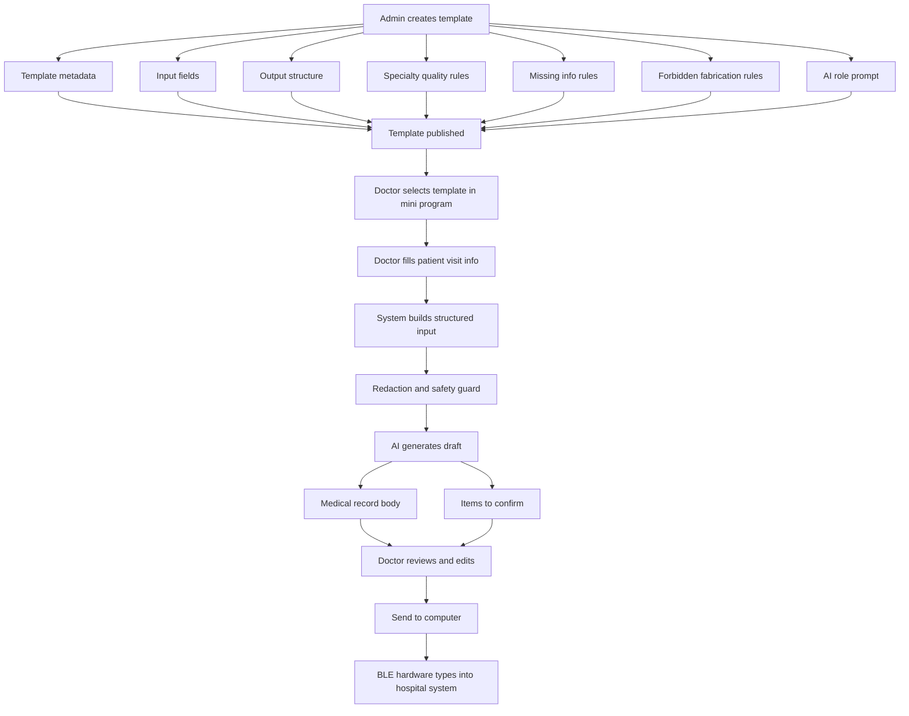

# AI Template Flow Explainer

> 2026-06-05 update: the default product positioning is now a general "AI content generation + offline computer input" tool. Professional examples in this document are only for restricted professional templates. They must not appear in the normal user's default entry points, copy, or template list. Normal users should see general templates such as office notes, reports, emails, and notices. Restricted templates are shown only after a bound device grants `professional` template access.

## 1. One Sentence

The template system is not just form filling. It is:

```text
Backend template rules + doctor input + AI safety rules
-> high-quality medical record draft
-> doctor confirmation
-> BLE transfer to hospital computer
```

## 2. Full Flow



## 3. Backend Template Configuration

Example: Orthopedics outpatient first visit.

```json
{
  "templateCode": "ORTHO_OUTPATIENT_FIRST",
  "name": "骨科门诊初诊病历",
  "department": "骨科",
  "scene": "门诊初诊",
  "type": "official",
  "description": "根据医生输入的骨科就诊信息生成门诊病历草稿",
  "status": "published"
}
```

### 3.1 Input Fields

These fields decide what the doctor sees in the mini program.

```json
[
  {
    "key": "chiefComplaint",
    "label": "主诉",
    "type": "textarea",
    "required": true,
    "placeholder": "请输入主要症状、部位和持续时间，例如：右膝疼痛3天"
  },
  {
    "key": "presentIllness",
    "label": "现病史补充",
    "type": "textarea",
    "required": false,
    "placeholder": "请输入起病经过、诱因、加重缓解因素、活动受限情况"
  },
  {
    "key": "injuryHistory",
    "label": "外伤史",
    "type": "select",
    "required": false,
    "options": ["无明显外伤", "有外伤", "不确定"]
  },
  {
    "key": "physicalExam",
    "label": "体格检查",
    "type": "textarea",
    "required": false,
    "placeholder": "请输入压痛、肿胀、活动度、畸形、神经血管情况"
  },
  {
    "key": "imaging",
    "label": "辅助检查",
    "type": "textarea",
    "required": false,
    "placeholder": "请输入X线、CT、MRI等检查结果，没有可留空"
  },
  {
    "key": "diagnosis",
    "label": "初步诊断",
    "type": "textarea",
    "required": false,
    "placeholder": "请输入医生已判断的诊断，AI不会自行新增诊断"
  },
  {
    "key": "plan",
    "label": "处理意见",
    "type": "textarea",
    "required": false,
    "placeholder": "请输入检查、用药、固定、复诊等处理计划"
  }
]
```

### 3.2 Output Structure

This decides the sections in the generated medical record.

```json
[
  "主诉",
  "现病史",
  "既往史",
  "体格检查",
  "辅助检查",
  "初步诊断",
  "处理意见"
]
```

### 3.3 Specialty Quality Rules

These rules help AI check whether the orthopedics record is complete enough.

```json
[
  "疼痛部位",
  "疼痛持续时间",
  "起病诱因",
  "外伤史",
  "肿胀",
  "活动受限",
  "畸形",
  "压痛部位",
  "关节活动度",
  "肌力和感觉",
  "末梢血运",
  "影像学检查",
  "初步诊断",
  "处理计划"
]
```

### 3.4 Missing Info Rules

These rules tell AI what to do when information is absent.

```json
[
  "未提供外伤史时，不得写“否认外伤史”，应写“外伤史未提供，待补充”。",
  "未提供影像结果时，不得写“X线未见异常”，应写“辅助检查未提供”。",
  "未提供查体时，不得编造压痛、活动度、肿胀、畸形等体征。",
  "未提供诊断时，不得自行生成明确诊断，只能写“待结合查体及辅助检查明确”。",
  "处理意见为空时，不得自动给药，只能提示“处理意见待医生确认”。"
]
```

### 3.5 Forbidden Rules

These are hard safety boundaries.

```json
[
  "不得编造患者年龄、性别。",
  "不得编造外伤史。",
  "不得编造查体结果。",
  "不得编造影像学结果。",
  "不得编造诊断。",
  "不得编造药物名称、剂量或疗程。",
  "不得把不确定内容写成确定事实。"
]
```

### 3.6 AI Role Prompt

This is the core instruction, maintained by backend admin.

```text
你是骨科门诊病历书写助手。
请基于医生提供的信息，生成结构完整、语言规范、便于粘贴到医院系统的门诊病历草稿。
你可以将口语化表达转为医学书写表达，可以将碎片信息归入合适栏目，可以提示缺失的骨科关键要素。
但你不得新增未提供的病史、查体、检查结果、诊断或治疗方案。
对缺失或不确定内容，请使用“未提供”“待补充”“待医生确认”等表达。
```

## 4. Frontend Doctor Input

The doctor only sees simple fields:

```text
骨科门诊初诊病历

主诉：
右膝疼痛3天

现病史补充：
爬楼后出现，活动后加重，上下楼困难

外伤史：
无明显外伤

体格检查：
右膝轻度肿胀，内侧压痛

辅助检查：
暂未检查

初步诊断：
右膝疼痛待查

处理意见：
建议完善右膝X线检查，减少负重
```

The doctor does not see prompt engineering details.

## 5. Data Merge Before AI

The system combines backend rules and doctor input into a structured AI request.

```text
模板：骨科门诊初诊病历
科室：骨科
场景：门诊初诊

医生填写内容：
主诉：右膝疼痛3天
现病史补充：爬楼后出现，活动后加重，上下楼困难
外伤史：无明显外伤
体格检查：右膝轻度肿胀，内侧压痛
辅助检查：暂未检查
初步诊断：右膝疼痛待查
处理意见：建议完善右膝X线检查，减少负重

输出结构：
主诉、现病史、既往史、体格检查、辅助检查、初步诊断、处理意见

骨科关键要素：
疼痛部位、持续时间、诱因、外伤史、肿胀、活动受限、压痛部位、关节活动度、神经血管情况、影像学检查、初步诊断、处理计划

禁止编造：
不得新增未提供的病史、查体、检查结果、诊断或治疗方案。
```

## 6. AI Output

The output should be split into two parts.

### 6.1 Medical Record Body

This part can be sent to the hospital computer.

```text
主诉：
右膝疼痛3天。

现病史：
患者3天前爬楼后出现右膝疼痛，活动后加重，伴上下楼困难。否认明显外伤史。疼痛性质、夜间痛及休息后缓解情况未提供，待补充。

既往史：
未提供，待补充。

体格检查：
右膝轻度肿胀，内侧压痛。关节活动度、稳定性试验及下肢神经血管情况未提供，待医生查体后补充。

辅助检查：
暂未完善相关检查。

初步诊断：
右膝疼痛待查。

处理意见：
建议完善右膝X线检查，近期减少负重。后续处理方案请结合查体及辅助检查结果进一步确认。
```

### 6.2 Items To Confirm

This part helps the doctor improve the record before sending.

```text
待医生确认/补充：
1. 疼痛具体部位是否为内侧、外侧或髌前？
2. 是否伴弹响、交锁或明显活动受限？
3. 关节活动度及稳定性试验结果是否需要补充？
4. 是否需要补充既往膝关节疾病或手术史？
5. 初步诊断和处理意见是否确认？
```

## 7. Product Value

The hardware solves:

```text
How to safely type text into the hospital intranet computer.
```

The AI template solves:

```text
How to generate better, more complete, more standardized medical text faster.
```

The strongest user flow is:

```text
Doctor chooses template
-> fills key facts
-> AI produces complete draft and missing-item checklist
-> doctor confirms
-> mini program sends text to hardware
-> hardware types into hospital system
```
